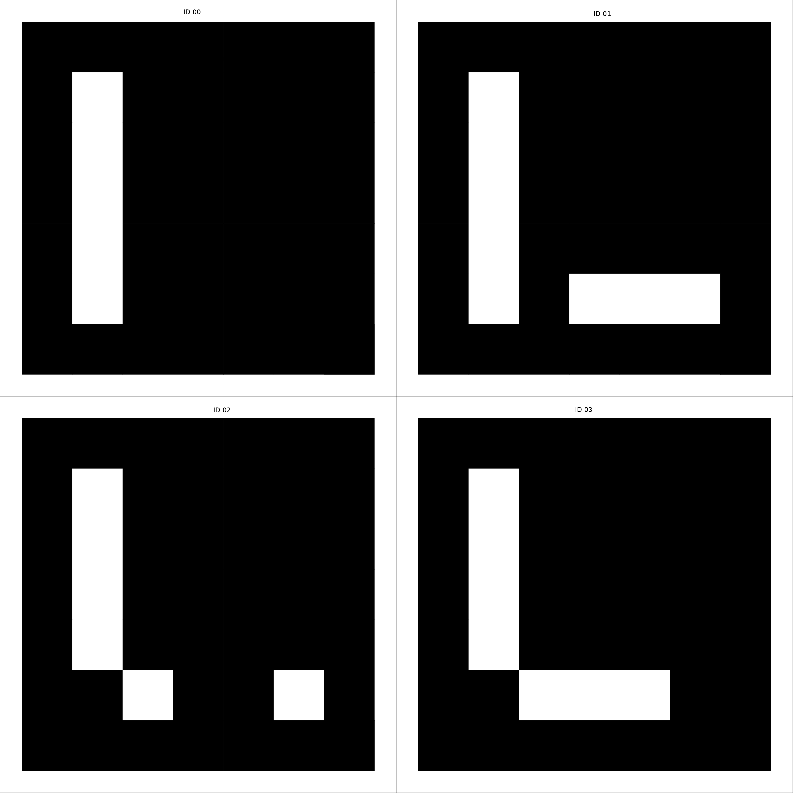

# ar_land

A ROS package for autonomously landing a quadrocopter (Crazyflie 2.0) using ArUco markers.

The system obtains an image from a wireless camera attached to the Crazyflie 2.0, the image is deinterlaced and the distortion is removed. Once the image is ready, the ar_sys package is used for Aruco marker detection and the relative 3D pose of the Crazyflie to the marker is estimated and published.
A Flatness based approach is used for position control of the quadrocopter. A trajectory planner plans a trajectory, which considers the model of the quadrocopter.

For former work see [ar_nav](https://github.com/raultron/ar_nav).

# Required harware
- Crazyflie 2.0 with a wireless camera attached to the bottom.


## Dependencies (non-native)

This package relies on several ROS packages:
- [usb_cam](http://wiki.ros.org/usb_cam): The usb_cam package interfaces with standard USB cameras and publish the images as a sensor_msgs.
- [tud_img_prep](https://github.com/raultron/tud_img_prep): The tud_image_prep package is a set of tools for processing camera images with techniques that include deinterlace of analog images and filtering.
- [ar_sys](https://github.com/raultron/ar_sys): For Aruco marker 3D pose estimation. In essence this can be replaced by any other marker.
- [crazyflie_ros](https://github.com/whoenig/crazyflie_ros): Official package for sending commands and receiving sensor information from the Crazyflie 2.0.  The package
contains core drivers to use the Crazyflie with ROS, a URDF model of the quadrotor, a simple navigation to goal if it is known
the external position and different demos ready to run for Crazyflie.

In the src directory of your ROS catking workspace:
```
cd ~\catkin_ws\src
```
Install required oficial ROS packages:
```
sudo apt-get install ros-kinetic-usb-cam 
```
Clone all the necessary packages:
```
git clone https://github.com/raultron/tud_img_prep.git

git clone -b kinetic-devel https://github.com/raultron/ar_sys.git

git clone https://github.com/whoenig/crazyflie_ros.git
cd crazyflie_ros
git submodule init
git submodule update
```
Use catkin_make on your workspace to compile.

The other packages should be in your ROS distribution.

Also the custom firmware for the crazyflie is required:

- [crazyflie_firmware](https://github.com/NikHoh/crazyflie-firmware): link to bitcraze site

## Optional Dependencies

- [image_proc](http://wiki.ros.org/image_proc): Image rectification, this package contains the image_proc node that removes camera distortion from the raw image stream, and if necessary will convert Bayer or YUV422 format image data to color. (it is assumed a proper camera calibration using ROS [camera_calibration](http://wiki.ros.org/camera_calibration) package or any other external tool) Usefull for camera with lense with not too much distortion.


## Usage

Print the marker board provided in the [data](data) folder. Use a calibrated printer so the markers have the correct measurement.

Our board configurations are named after the robots of our lab (we attach the marker boards on top of them).

### C3PO:



- Top Left corner: ID0
- Top Right corner: ID1
- Bottom Left corner: ID2
- Bottom Right corner: ID3
- Aruco marker Side length = 16 cm
- Separation Between Markers = 2 cm
- Coordinate system = located in the center of the marker. Holding the marker board in your hands and looking straigth to it with ID0 on the top left corner: X axis right, Y axis up and Z axis coming out of the marker plane.
- Yaml file for ar_sys: [board_c3po.yml](data/board_c3po.yml)


### Wide-Angle-Lense Camera Calibration

For the calibration of the Fx797T shutter cam we provide a python script to get the camera parameters. The ROS package [camera_calibration](http://wiki.ros.org/camera_calibration) GUI and documentation might be helpful to get good images. Put them in a folder an run the calibrate.py script from [data](data) inside.
